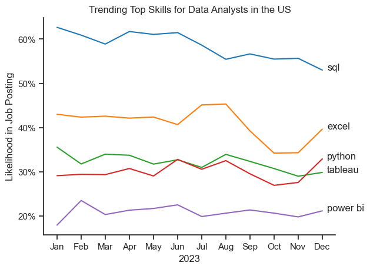
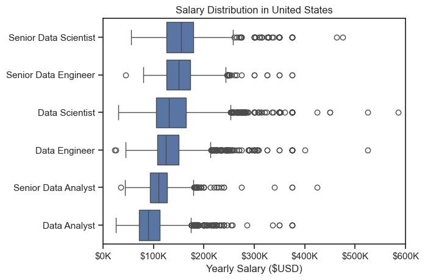
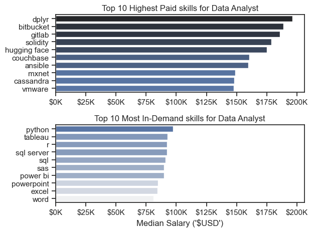
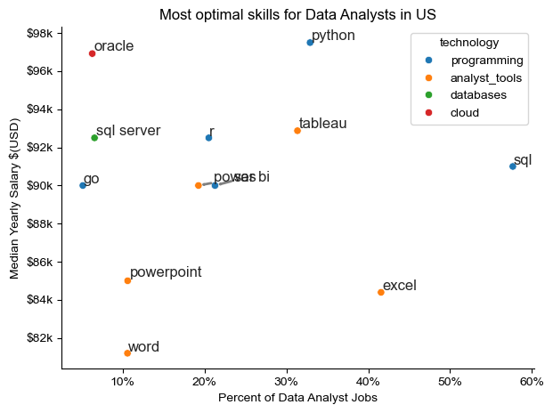

# Overview

Welcome to my analysis of the data job market, focusing on data analyst roles. This project was created out of a desire to navigate and understand the job market more effectively. It delves into the top–paying and in–demand skills to help find optimal job opportunities for data analysts.

# The Questions

Below are the questions I want to answer in this project:
 1. What are the skills most in demand for the top 3 most popular data roles?
 2. How are in-demand skills trending for Data Analysts?
 3. How well do jobs and skills pay for Data Analysts?
 4. What are the optimal skills for Data Analysts to learn? (High Demand and High Paying)

# Tools I Used

For my deep dive into the data analyst job market, I harnessed the power of several key tools:

- **Python**: The backbone of my analysis, allowing me to analyze the data and find critical insights.  
  I also used the following Python libraries:  
  - **Pandas Library**: This was used to analyze the data.  
  - **Matplotlib Library**: I visualized the data.  
  - **Seaborn Library**: Helped me create more advanced visuals.

- **Jupyter Notebooks**: The tool I used to run my Python scripts, which let me easily include my notes and analysis.

- **Visual Studio Code**: My go-to for executing my Python scripts.

- **Git & GitHub**: Essential for version control and sharing my Python code and analysis, ensuring collaboration and reproducibility.


# Analysis
## 1. What are the skills most in demand for the top 3 most popular data roles?

To find the most demanded skills for the top 3 most popular data roles. I filtered out those positions by which ones were the most popular and got the top 5 skills for these top 3 roles. This query highlights the most popular job titles and their top skills, showing which skills I should pay attention to depending on the role I'm targeting.

View my notebook with detailed steps here:
[2_Skills_Demand](C:\Users\sharb\OneDrive\Documents\python_data_project\3_Final_Project\2_Skills_Demand.ipynb)

    ``` 
    sns.set_theme(style='ticks')

    fig, ax = plt.subplots(len(job_titles), 1)
    for i, job_title in enumerate(job_titles):
        df_plot = df_skills_perc[df_skills_perc['job_title_short'] == job_title].head(5)
        #df_plot.plot(kind='barh', x='job_skills', y='skill_perc', ax=ax[i], title=job_title, legend=False)
        sns.barplot(data=df_plot, x='skill_perc', y='job_skills', ax=ax[i], hue='skill_count', palette='dark:b_r', legend=False)
        # sns generally plots from largest to smallest order hence we do not need 'invert_yaxis' command here
        ax[i].set_ylabel("")
        ax[i].set_title(job_title)
        ax[i].set_xlabel("")
        ax[i].set_xlim(0, 80)

        for n, v in enumerate (df_plot['skill_perc']):
            ax[i].text(v+3, n, f'{v:.0f}%', va='center')
            # v → the actual percentage value (e.g., 72.3).
            # n → the index position of the bar in the chart (0 for top, 1 for next, etc.).
            # This gives you a way to know both the value and its vertical position in the plot.

        if i != len(job_titles) - 1:
            ax[i].set_xticks([])

    fig.suptitle('Likelihood of Skills Requested in US Job Postings', fontsize=15)
    fig.tight_layout()
    plt.show() ```

#### Results


- **Data Scientist**
  - Python dominates (72%), followed by SQL (51%) and R (44%).
  - SAS and Tableau both at 24%.

- **Data Analyst**
  - SQL leads (51%), with Excel (41%) in second.
  - Tableau (28%), Python (27%), SAS (19%) follow.

- **Data Engineer**
  - SQL (68%) and Python (65%) are top.
  - AWS (43%), Azure (32%), Spark (32%) also significant.


## 2. How are in-demand skills trending for Data Analysts?

For this analysis, I tracked the monthly demand for each skill listed in U.S. Data Analyst job postings. I calculated the percentage of postings mentioning each skill, identified the top 5, and plotted their trends over time. This shows how the demand for these skills rises or falls throughout the year.

View my notebook with detailed steps here:
[3.Skills_Trend](C:\Users\sharb\OneDrive\Documents\python_data_project\3_Final_Project\3_Skills_Trend.ipynb)

    ```
    df_plot = df_DA_US_perc.iloc[:, :5]
    sns.lineplot(df_plot, dashes=False, palette='tab10')
    sns.set_theme(style='ticks')
    sns.despine()            #removes the right line of the box.
    plt.title('Trending Top Skills for Data Analysts in the US')
    plt.ylabel('Likelihood in Job Posting')
    plt.xlabel('2023')
    plt.legend().remove()

    # to add '%' on y-axis values.
    from matplotlib.ticker import PercentFormatter
    ax = plt.gca()
    ax.yaxis.set_major_formatter(PercentFormatter(decimals=0))

    for i in range (5):
        plt.text(11.2, df_plot.iloc[-1, i], df_plot.columns[i])     # x =(11 as there are 12 months so n-1 = 11.)
        # y = (.iloc[-1, i] picks the last row (-1) and the i-th column (i)) This gives the last y-value for each skill's line in the plot.
        #It annotates the last point of each line with the skill name, so you can identify which line corresponds to which skill without needing a legend. ```

#### Results


Here are concise bullet points from the visualization:

1. SQL is the most in-demand skill (~55–63%) and remains consistently on top throughout 2023.
2. Excel stays second, peaking mid-year (~46%) but dips in September–November.
3. Python and Tableau hover in the mid-range (~27–35%), with small fluctuations.
4. Power BI is the least mentioned (~18–24%), with only slight seasonal changes.
5. All skills show some mid-year peaks followed by declines toward the end of the year.


## 3. How well do jobs and skills pay for data analysts?

### Investigating Skills, Demand, and Salary for Data Analysts in the US

This analysis explores the relationship between job market demand and compensation for Data Analyst skills in the United States.

1. **Top Trending Skills**  
   We identify the top skills appearing in job postings for Data Analysts throughout 2023 and visualize their trends over time. This shows which technical abilities are gaining momentum in the market.

2. **Median Salary vs. Skill**  
   We filter postings for Data Analysts in the US, remove missing salary data, and explode the skill lists. For each skill, we calculate the median salary and count of job postings.  
   Two bar charts compare:  
   - **Top 10 highest-paying skills** (ranked by median salary)  
   - **Top 10 most in-demand skills** (ranked by posting count)  

Together, these insights reveal not only which skills are popular, but also which offer the highest earning potential — helping professionals prioritize learning skills that balance demand and salary.

View my notebook with detailed steps here:
[4_Salary_Analysis](C:\Users\sharb\OneDrive\Documents\python_data_project\3_Final_Project\4_Salary_Analysis.ipynb)

```
sns.boxplot(data=df_US_top6, x='salary_year_avg', y='job_title_short', order=job_order)      
#unlike using pandas, we had to provide the data in a series manner, here using seaborn we have to provide data as data frame only defining x and y axis 

plt.title("Salary Distribution in United States")

ax = plt.gca()
ax.xaxis.set_major_formatter(plt.FuncFormatter(lambda x, pos: f'${int(x/1000)}K'))
plt.xlabel("Yearly Salary ($USD)")
plt.ylabel("")
plt.xlim(0, 600000)
plt.show()
```
#### Results



### Salary Distribution in the United States

This box plot visualizes the yearly salary distribution for different data-related roles in the U.S.

### Key Insights
- **Senior roles** (especially Senior Data Scientist) generally have higher median salaries compared to junior positions.
- **Data Scientists** earn slightly higher salaries than Data Analysts, both at senior and junior levels.
- **Data Engineers** show competitive salaries, often overlapping with Data Scientists.
- **Senior Data Analysts** earn more than regular Data Analysts but less than Data Scientists and Engineers.
- Salaries for most roles cluster between **$80K and $200K** annually.
- Outliers exist for all roles, with some exceeding **$500K**, especially among Data Scientists and Data Engineers.


```
fig, ax = plt.subplots(2, 1)

sns.set_theme(style='ticks')

sns.barplot(data=df_DA_top_pay, x='median', y=df_DA_top_pay.index, ax=ax[0], hue='median', palette='dark:b_r', legend=False)
#df_DA_top_pay.plot(kind='barh', y='median', ax=ax[0], legend=False)           #for plotting this graph on the 1st subplot
#ax[0].invert_yaxis()
ax[0].set_title('Top 10 Highest Paid skills for Data Analyst')
ax[0].set_ylabel("")
ax[0].set_xlabel("")
ax[0].xaxis.set_major_formatter(plt.FuncFormatter(lambda x, _: f'${int(x/1000)}K'))


sns.barplot(data=df_DA_skills, x='median', y=df_DA_skills.index, ax=ax[1], hue='median', palette='light:b', legend=False)
#df_DA_skills.plot(kind='barh', y='median', ax=ax[1], legend=False)
#ax[1].invert_yaxis()
ax[1].set_xlim(ax[0].get_xlim())        #sets the xlim of 2nd subplot equal to the 1st subplot
ax[1].set_title('Top 10 Most In-Demand skills for Data Analyst')
ax[1].set_ylabel("")
ax[1].set_xlabel("Median Salary ('$USD')")
ax[1].xaxis.set_major_formatter(plt.FuncFormatter(lambda x, _: f'${int(x/1000)}K'))

plt.tight_layout()
```

#### Results



### Top Skills for Data Analysts in the US

#### Highest Paid Skills
- **dplyr** tops the chart with salaries close to $200K.
- **Bitbucket**, **GitLab**, and **Solidity** also offer salaries above $175K.
- AI/ML-related tools like **Hugging Face** and **MXNet** show high salary potential.
- Cloud and database tools (**Couchbase**, **Cassandra**) appear among the top-paying skills.

#### Most In-Demand Skills
- **Python** and **Tableau** lead the demand for Data Analyst roles.
- Core database skills (**SQL Server**, **SQL**) remain highly requested.
- Analytical and BI tools (**SAS**, **Power BI**) are consistently sought after.
- General productivity tools (**Excel**, **PowerPoint**, **Word**) maintain strong presence in job postings.


## 4. What is the most optimal skill to learn for Data Analysts?

To determine the most valuable skill for Data Analysts in the US, I filtered job postings for this role, removed missing salary data, and calculated the demand percentage and median salary for each skill. I then kept only high-demand skills (appearing in more than 5% of postings) and linked them to their broader technology categories. The results were visualized in a scatter plot, showing which skills offer both high demand and high salary — helping identify the optimal skill to focus on.

View my notebook with detailed steps here:
[5_Optimal_Skills](C:\Users\sharb\OneDrive\Documents\python_data_project\3_Final_Project\5_Optimal_Skills.ipynb)

```
from adjustText import adjust_text

#df_plot.plot(kind='scatter', x='skill_percent', y='median_salary')
#using seaborn as we want to color code the final graph

sns.scatterplot(
     data=df_plot,
     x='skill_percent',
     y='median_salary',
     hue='technology')

sns.despine()
sns.set_theme(style='ticks')
plt.xlabel('Percent of Data Analyst Jobs')
plt.ylabel('Median Yearly Salary $(USD)')
plt.title('Most optimal skills for Data Analysts in US')
plt.tight_layout()

texts= []                                 #fills this list every time the for loop operates ans 'txt' is formed
for i, txt in enumerate(df_DA_skills_high_demand.index):
     texts.append(plt.text(df_DA_skills_high_demand['skill_percent'].iloc[i], df_DA_skills_high_demand['median_salary'].iloc[i], txt))     #At the point where skill_percent is X and median_salary is Y, show the skill name as a label.

adjust_text(texts, arrowprops=dict(arrowstyle='->', color='gray', lw=2))

#to hunt the y-axis and change it's ormat to '$85k'
ax = plt.gca()    #get current axis
ax.yaxis.set_major_formatter(plt.FuncFormatter(lambda y, pos: f'${int(y/1000)}k'))

# ax - The Axes object (your plot). You must have something like fig, ax = plt.subplots() before this.
# ax.yaxis - Refers to the Y-axis of your plot.
# .set_major_formatter(...) - Sets the format for the major ticks (main labels) on that axis.
# plt.FuncFormatter(...) - A formatter class that lets you define custom functions to format tick labels.
# lambda y, pos: ... - A small anonymous function that formats each tick value y.
# f'${int(y/1000)}k' - This converts values like 125000 into $125k.

# to add '%' on y-axis values.
from matplotlib.ticker import PercentFormatter
ax = plt.gca()
ax.xaxis.set_major_formatter(PercentFormatter(decimals=0))
plt.show()
```
#### Results


### 📊 Most Optimal Skills for Data Analysts in the US

This chart compares **skill demand** (x-axis) with **median yearly salary** (y-axis) for Data Analyst roles in the US, categorized by technology type.

#### 📌 Key Takeaways

- **SQL** → Most in-demand (~55–60% of jobs) with solid salary (~$92k).
- **Python** → High salary (~$98k) and strong demand (~20%); excellent for career growth.
- **Excel** → Widely required (~40% demand) but lower salary (~$84k); considered a baseline skill.
- **Tableau** → Strong balance of demand (~30%) and salary (~$94k) for visualization work.
- **Cloud & Database Skills (Oracle, SQL Server)** → Lower demand but high salaries (~$93k–$97k); great for specialized roles.
- **PowerPoint & Word** → Lower salary impact despite usage in reporting/documentation.

---

#### 📈 Interpretation
- Skills like **Python** and **Tableau** provide the best balance of **salary potential** and **market demand**.
- **SQL** is a must-have due to its dominant presence in job requirements.
- **Specialized database/cloud skills** can lead to high pay despite lower demand.
- Basic tools (**Excel, Word, PowerPoint**) are often prerequisites but do not significantly raise salary levels.

# What I Learned

Throughout this project, I deepened my understanding of the data analyst job market and enhanced my technical skills in Python, especially in data manipulation and visualization.  

### Key Takeaways

- **Advanced Python Usage**:  
  Utilizing libraries such as **Pandas** for data manipulation, **Seaborn** and **Matplotlib** for data visualization, and other libraries helped me perform complex data analysis tasks more efficiently.

- **Data Cleaning Importance**:  
  I learned that thorough data cleaning and preparation are crucial before any analysis can be conducted, ensuring the accuracy of insights derived from the data.

- **Strategic Skill Analysis**:  
  The project emphasized the importance of aligning one's skills with market demand. Understanding the relationship between skill demand, salary, and job availability allows for more strategic career planning in the tech industry.


# Insights


This project provided several general insights into the data job market for analysts:

- **Skill Demand and Salary Correlation**:  
  There is a clear correlation between the demand for specific skills and the salaries these skills command.  
  Advanced and specialized skills like **Python** and **Oracle** often lead to higher salaries.

- **Market Trends**:  
  There are changing trends in skill demand, highlighting the dynamic nature of the data job market.  
  Keeping up with these trends is essential for career growth in data analytics.

- **Economic Value of Skills**:  
  Understanding which skills are both in-demand and well-compensated can guide data analysts in prioritizing learning to maximize their economic returns.

# Challenges I Faced


This project was not without its challenges, but it provided valuable learning opportunities:

- **Data Inconsistencies**: Handling missing or inconsistent data entries required careful consideration and thorough data-cleaning techniques to ensure the integrity of the analysis.
- **Complex Data Visualization**: Designing effective visual representations of complex datasets was challenging but crucial for conveying insights clearly and compellingly.
- **Balancing Breadth and Depth**: Deciding how deeply to dive into each analysis while maintaining a broad overview of the data landscape required constant balancing to ensure comprehensive coverage without getting lost in details.


# Conclusions


This exploration into the data analyst job market has been incredibly informative, highlighting the critical skills and trends that shape this evolving field. The insights gained enhanced my understanding and provided actionable guidance for anyone looking to advance their career in data analytics.

As the market continues to change, ongoing analysis will be essential to stay ahead in data analytics. This project serves as a solid foundation for future explorations and underscores the importance of continuous learning and adaptation in the data field.


